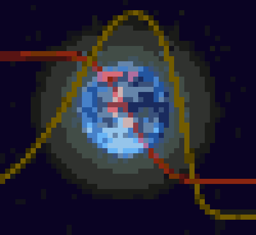
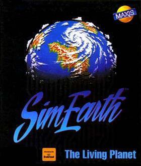
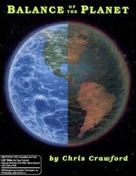
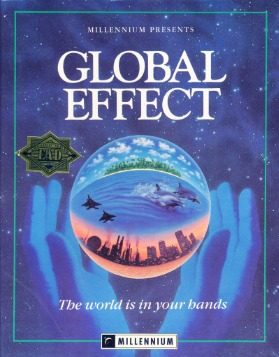
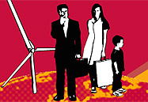
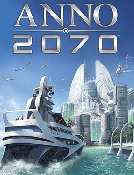
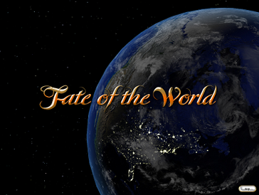

# Retrocomputing Resources about Global Change

Awareness about ongoing global change emerged  from the 1970’s. It led to the use of computer to build 
and simulate a variety of global models focusing or combining aspects like finite resource, climate, 
socio-economics or urbanisation. This talk is a retro-computing journey across different implementations over time. 
It will focus first on scientific aspects initiated by World3 of the “limit to growth” report and the Gaia hypothesis 
with its related Daisy world.  It will then explore a range of (serious) games 
like STRATAGEM, SimEarth, Balance of Planets, Global Effect, EcoQuest, Anno 2070, Fate of the World...
Different aspects such as code, user interface, model complexity will be put in the perspective of 
the evolution of computer languages and the exponential growth of computation power. 
It will conclude with some thoughts based on the emerging global picture in the context of the challenges 
our world is currently facing.

## System Dynamics related

### Limit to Growth (World3)

* Year: circa 1970 (for model, DYNAMO OLDER)
* Language: DYNAMO, evolution of SIMPLE, pure text (later enriched with graphical language STELLA)
* Platform: IBM mainframe (initially on punch card) then ported to mini and micro, implemented in ASM then FORTRAN
* Authors: Donella Hager-Meadows, Dennis L. Meadows, Jorgen Randers and William W. Behrens III.
* Approach: code generation, low/no code already (textual then graphical) to be used by non computer programmers

Simulator (Bernd Fix)
* Not much available of the original software but there is a nice [simulator for DYNAMO](https://github.com/bfix/dynamo) by Bernd Fix
* about [Bernd Fix](https://en.wikipedia.org/wiki/Bernd_Fix) (maybe not expected here)

Documentation:
* Original DYNAMO [user manual](SystemDynamics/LTG/dynamousersmanua00pugh.pdf)
* Review paper from 1990: (World Dynamics revisited, a Realistic World Model Simulation)[SystemDynamics/LTG/chagchit1990.pdf]

### STRATAGEM (serious game)

* Year: 1985 (maybe earlier version to check)
* Language: PC-BASIC, see [code here](SystemDynamics/STRATAGEM/stratagm.bas)
* Platform: Microcomputer (IBM-PC)
* Author: John Stearman and Dennis Meadows
* Approach: turn based (by 2 years) with textual menu and text-based graphics

Documentation:
* Paper by Stearman and Meadows (1985 version) [STRATAGEM-2](SystemDynamics/STRATAGEM/sterman1985.pdf)
] with source code in annex
* more information [about Kondratieff waves](SystemDynamics/STRATAGEM/Kondratieff_Waves_in_the_World_System_Perspective.pdf)

## Games

### SimEarth

* Year: 1990
* Language: C ?
* Platform: microcomputer
* Author: Will Wright
* note: includes Daisy World simulation

Documentation:
* [game manual](Games/SimEarth/SimEarth-Manual-DOS.pdf)
* paper [Gaia's Game](Games/SimEarth/GaiasGames.pdf)
* [official strategy guide](https://archive.org/details/simearth00ruse)

### Balance of the Planet

* Year: 1990
* Language: Macintosh Pascal (and Java rewrite around 2010) 
* Platform: microcomputer
* Author: Chris Crawford

Source code:
* [Chris Crawford Erasmatazz website](https://www.erasmatazz.com/library/source-code/index.html)
* [local archive of Pascal version](Games/BOTP/balance-of-the-planet.zip)

Documentation:
* Manual (text version vs full version)

Quote:
* Forcing the player to explicitly assign point values for human life puts a lot of stress on people, stress that most people avoid by refusing to think about it. This game shoved the problem 
right into their faces. It turns out that, if you assign equal values to both forms of death, you can never win the game, because the number of people who die from starvation each year is overwhelming.

### Global Effect

* Year: 1992
* Language:
* Platform: microcomputer
* Author: Millennium Interactive Ltd.

### BBC Climate Challenge

* Year 2006
* Language: flash
* Platform: web-browser
* Author: Red Redemption Ltd
* Approach: turn-based policy decision/negociation game

Documentation
* [original game website](https://www.bbc.co.uk/sn/hottopics/climatechange/climate_challenge/aboutgame.shtml) at BBC 
* [flashpoint player](https://flashpointarchive.org/) (open source) with archived game  

### Anno 2070

* Year 2011
* Platform: microcomputer (STEAM)
* Author: Related Designs, Blue Byte
* Approach: flooded world scenario, 3 possible factions (eco, tech, tycoons)

### Fate of the Worlds

* Year 2011
* Platform: microcomputer (STEAM)
* Author: Red Redemption
* Approach: turn based (by 5 years), various socip-technico-environmental scenarios

Documentation:
* [review](https://www.destructoid.com/reviews/review-fate-of-the-world)

# Licence

* The original documentation material of this github page is released under Creative Commons, Share Alike.
* Resource under version control are not mirrored here, see their respective repoitiory for licence (e.g. GNU Affero for Bernd Fix's DYNAMO or GNU GPL for micropolis by Don Hopkins)
* Note some retrocomputing projects have released their source code without specific licence (e.g. Global Change source archive by Chris Crawford which is mirrored here or STRATAGEM which was retyped from listing)